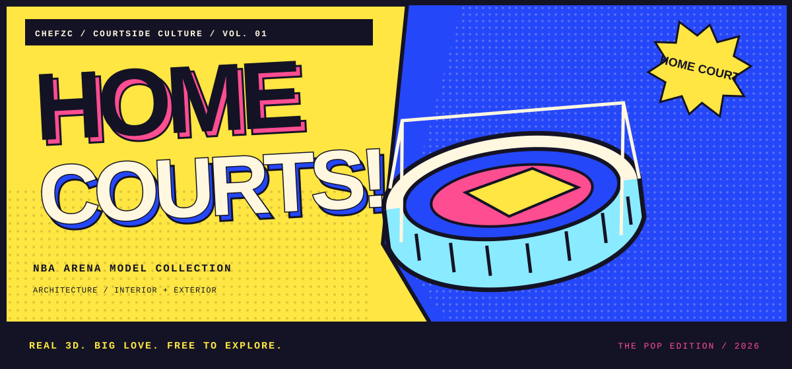
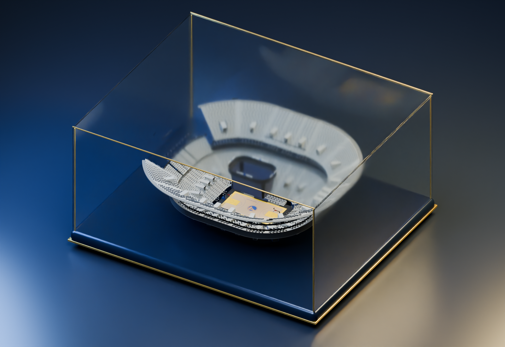
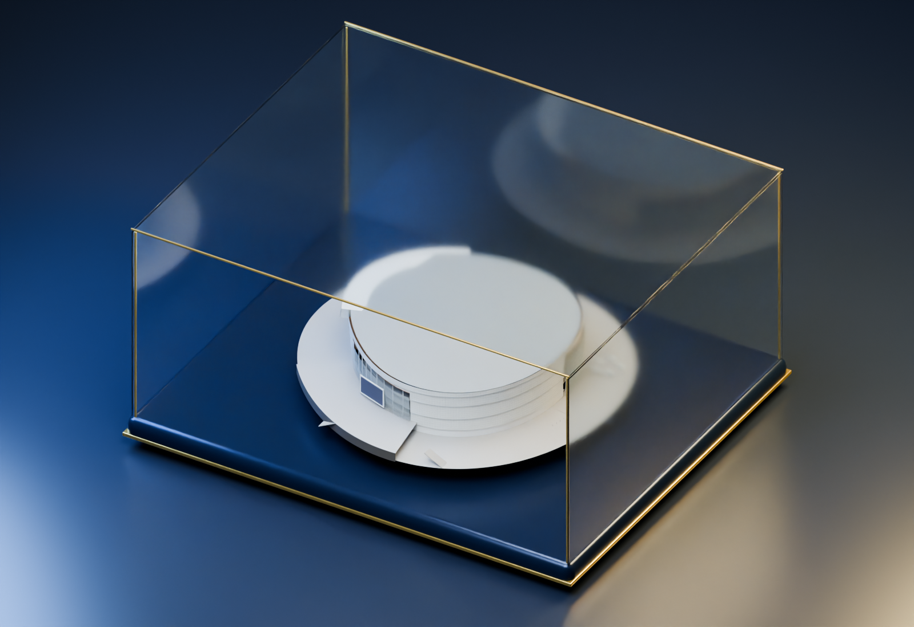
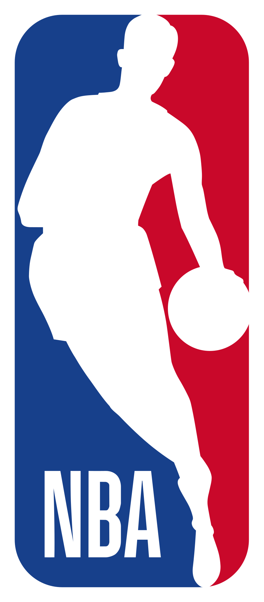

<b>English</b> · <a href="README.zh-CN.md">简体中文</a>

<a href="https://chefzc-homepage.vercel.app/models-gallery.html#project-chase-center"><b>ENTER THE 3D EXHIBITION ↗</b></a> &nbsp; / &nbsp; <a href="https://github.com/ChefDavid0815/nba-arena-models/releases/tag/v0.1.0"><b>FREE DOWNLOAD ↓</b></a> &nbsp; / &nbsp; <a href="docs/UNREAL.md">UNREAL GUIDE</a>

# NBA Arena Models

A home court is made of small things worth looking at closely. This growing collection begins with **Chase Center**: court and tiers inside; cladding, entrances and plaza outside. One building, two glass cases.

<table><tr><td width="50%"></td><td width="50%"></td></tr><tr><td align="center">01 / THE COURT · 内景</td><td align="center">02 / THE CITY · 外景</td></tr></table>

### `01` &nbsp; The first edition

| Collection card | Details |
| :--- | :--- |
| First work | Chase Center |
| Edition | v0.1.0 · Blender CP80 |
| Files | Complete interior/exterior Blender source; cutaway and exterior FBXs; web GLBs |
| Units | 1 Blender unit = 1 m; court 28.6512 × 15.24 m |
| Seating | 13,332 native instances; not a claim about official venue capacity |

### `02` &nbsp; Open the collection

Download **ChaseCenter-v0.1.0.zip** from Releases, verify it against **SHA256SUMS.txt**, and extract it. Complete modeling files live in versioned GitHub Release packages; this repository keeps documentation, the catalogue, cover art and lightweight previews.

[**Download v0.1.0 ↓**](https://github.com/ChefDavid0815/nba-arena-models/releases/tag/v0.1.0) · [**Unreal import steps ↗**](docs/UNREAL.md) · [**Version history ↗**](CHANGELOG.md)

The arena is reference-informed, not a surveyed architectural reconstruction. Court styling follows the designated reference; season identity is unverified. The web cutaway omits the roof and reduces seating density; the native Blender file keeps the complete work. Procedural shaders are simplified for FBX/GLB. Collision, LODs, Nanite, light baking and game performance still need project-specific setup.

### `03` &nbsp; Room for the next model

Future arenas will get their own catalogue folders, cover art, versions, downloads and validation notes. Older versions stay available.

[Collection catalogue](catalog.json) · [Collection journal](https://chefzc-homepage.vercel.app/post.html?article=courtside-collection) · [The companion collection](https://github.com/ChefDavid0815/nba-player-models)

### `04` &nbsp; Provenance & use

Free to download. Modeling files, required materials/textures and import notes only; no reference library, research documents, caches or working backups. An unofficial fan collection, unaffiliated with the NBA, teams, players or venue. Third-party mod, trademark, likeness and material rights retain their original terms. A free download is not a CC0 dedication or a grant of third-party commercial rights.

[Full usage notes](ASSET-USAGE.md) · [Asset credits](CREDITS.md)

 &nbsp;&nbsp; 

CHEFZC ATELIER · ONE HOME COURT. ROOM FOR ANOTHER. 保持热忱，保持热爱 · VIVA LA VIDA

